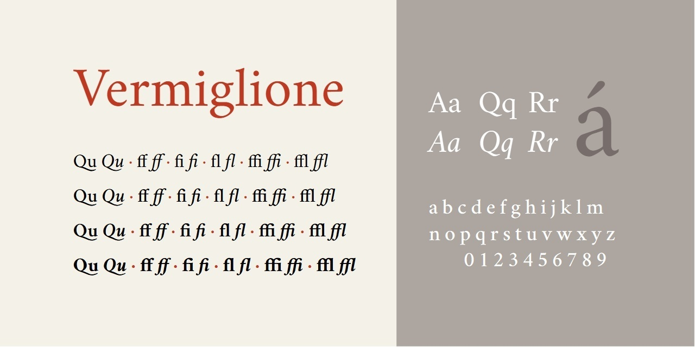

# Vermiglione
- Versione 1.0: versione iniziale.

Per testare il font, vedere la [pagina interattiva](https://m-casanova.github.io/Vermiglione/).

## Descrizione

**Vermiglione** è un test (con un sottoinsieme di caratteri limitato) per la creazione  di un font variabile derivato dal font [*Cochineal*](https://ctan.org/pkg/cochineal) (Michael Sharpe),
a sua volta derivato da [*Crimson*](https://github.com/skosch/Crimson) (Sebastian Kosch).

Il font potrebbe presentare alcuni problemi.
