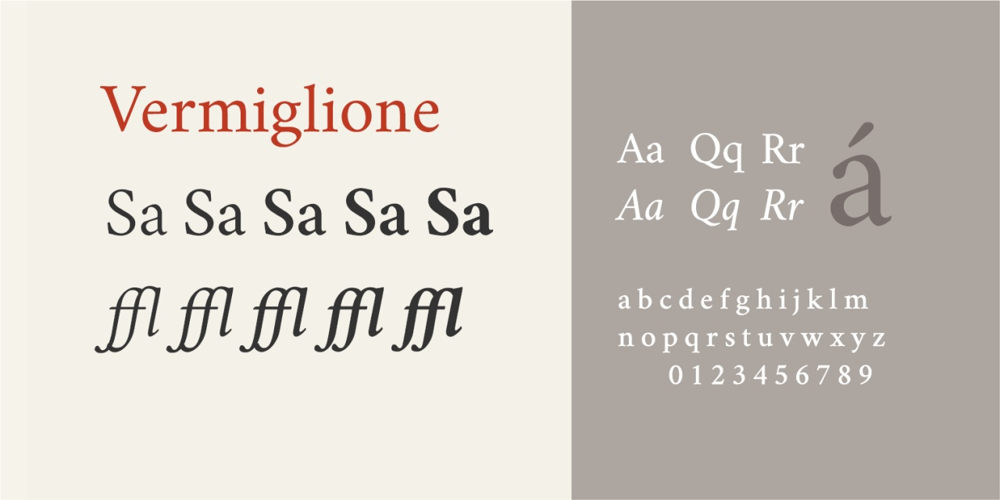
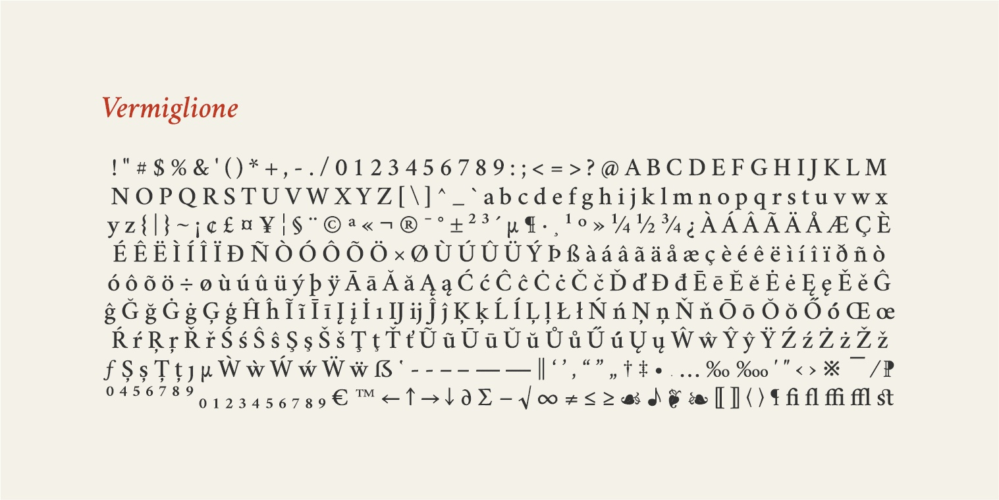

# Vermiglione
- Versione 1.505: fix caratteri
- Versione 1.504: revisione generale e aggiunta di alcuni caratteri
- Versione 1.105: fix caratteri
- Versione 1.1: estensione della versione variabile fino wght=200, includendo ExtraLight e Light
- Versione 1.0: versione iniziale.

Per testare il font nella versione variabile, vedere la [pagina interattiva](https://m-casanova.github.io/Vermiglione/).

## Formati
La versione variabile è disponibile nella cartella *font* (formati TTF e WOFF2).
La versione fissa (Regular, News, Medium, SemiBold, Bold con corrispondenti corsivi) è disponibile nelle cartelle *otf* (formato OTF) e *ttf* (formato TTF).

## Descrizione

**Vermiglione** è un test (con un sottoinsieme di caratteri limitato) per la creazione  di un font variabile derivato dal font [*Cochineal*](https://ctan.org/pkg/cochineal) (Michael Sharpe),
a sua volta derivato da [*Crimson*](https://github.com/skosch/Crimson) (Sebastian Kosch).

Il font potrebbe presentare alcuni problemi.

